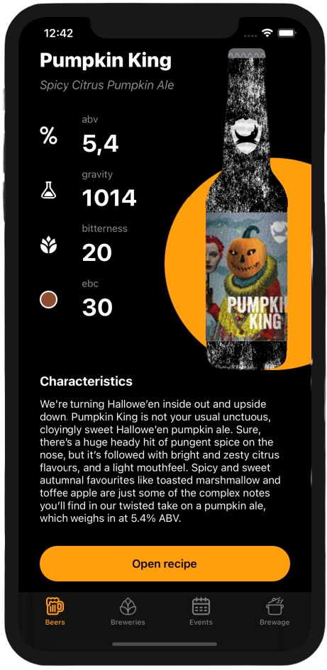

## All brewing data in your pocket.

[](https://opensource.org/licenses/MIT) 
[](https://www.apple.com/pl/ios/)
[](https://developer.apple.com/swift)
[](https://travis-ci.com/Crunkz/BeerPal)
[](https://www.codacy.com/gh/Crunkz/BeerPal/dashboard?utm_source=github.com&amp;utm_medium=referral&amp;utm_content=Crunkz/BeerPal&amp;utm_campaign=Badge_Grade)
[](https://www.codefactor.io/repository/github/crunkz/beerpal)
[](https://codebeat.co/projects/github-com-crunkz-beerpal-develop)

> **UIKit** · **SnapKit** · **RxSwift** · **RxCocoa** · **RxFeedback** · **Coordinators** · **PropertyWrappers** · **NSCache** · **State management** · **Rich links** · **Safe assets** · **Data binding** · **Dependencies management** · **Local storage** · **Static analysis** · **Alamofire** · **XCTest** · **Reactive extensions**

**BeerPal** is a showcase project that presents my approach to iOS application development with up to date tech-stack, as I am unable to show programs I work on a regular basis. 

The app provides a variety of beer-related information through the use of the open [BreweryDB API](https://www.brewerydb.com/developers) and has been designed from scratch with a strong emphasis on providing the best UX possible.

## Characteristics

Briefly, the project consists of:

* 100% [Swift](https://developer.apple.com/swift/)
* MVVM + C architecture
* Reactive UI
* [CI pipeline](https://github.com/features/actions)
* Testing (Unit, UI)
* Static analysis tools
* Dependency Injection
* Apple Human Interface Guidelines

## Toolkit



Deployment target was set to iOS 13.0 as it is installed on 96.5% of devices (as of Oct 20, 2020). 

The project takes advantage of many popular platform libraries and each of them is in the stable version.

* **External libraries**
	 * [Alamofire](https://github.com/Alamofire/Alamofire) - elegant networking
    * [SwiftLint](https://github.com/realm/SwiftLint) - static source code analysis
    * [R.swift](https://github.com/mac-cain13/R.swift) - safe, strong typed resources
    * [SnapKit](https://github.com/SnapKit/SnapKit) - well-known [DSL](https://www.swiftbysundell.com/articles/building-dsls-in-swift/) that helps in creating UI from code
    * [RxSwift](https://github.com/ReactiveX/RxSwift) - reactive programming in Swift, Combine's forerunner
    * [RxCocoa](https://cocoapods.org/pods/RxCocoa) - reactive Cocoa API wrapper containing powerful traits system
    * [RxDataSources](https://github.com/RxSwiftCommunity/RxDataSourcesf) - bindable complex data sets
    * [RxFeedback](https://github.com/NoTests/RxFeedback.swift) - handling state in a reactive manner
    * [Nuke](https://github.com/kean/Nuke) - efficient image loading and caching system

* **Software**
	* Xcode 11.4.1, 12.1
	* Sketch
	* Adobe XD

## Upcoming improvements 

- Core Data local recipe storage
- UIUserInterfaceStyle support
- UI Tests
- Additional brewing calculators

## Getting started

**Prerequisites**: CocoaPods, Xcode 11.4+

1. Open Terminal.
2. Run following commands:

	```
	git clone https://github.com/crunkz/beerpal
	cd beerpal/Sources/
	pod install
	open BeerPal.xcworkspace/
	```
3. [Obtain an API key](https://www.brewerydb.com/developers/apps#) and paste it in `/Sources/App/AppConfig.swift`.

## Contact

<a href="https://www.linkedin.com/in/krzysztofbabis/"></a>
<a href="mailto:krzysztofbabis@icloud.com"></a>

If you have any questions or suggestions, do not hesitate to reach me out!

## License
```
MIT License

Copyright (c) 2020 Krzysztof Babis

Permission is hereby granted, free of charge, to any person obtaining a copy of this software and 
associated documentation files (the "Software"), to deal in the Software without restriction, including 
without limitation the rights to use, copy, modify, merge, publish, distribute, sublicense, and/or sell 
copies of the Software, and to permit persons to whom the Software is furnished to do so, subject to 
the following conditions:

The above copyright notice and this permission notice shall be included in all copies or substantial 
portions of the Software.

THE SOFTWARE IS PROVIDED "AS IS", WITHOUT WARRANTY OF ANY KIND, EXPRESS OR IMPLIED, INCLUDING BUT NOT 
LIMITED TO THE WARRANTIES OF MERCHANTABILITY, FITNESS FOR A PARTICULAR PURPOSE AND NONINFRINGEMENT. IN 
NO EVENT SHALL THE AUTHORS OR COPYRIGHT HOLDERS BE LIABLE FOR ANY CLAIM, DAMAGES OR OTHER LIABILITY, 
WHETHER IN AN ACTION OF  TORT OR OTHERWISE, ARISING FROM, OUT OF OR IN CONNECTION WITH THE 
SOFTWARE OR THE USE OR OTHER DEALINGS IN THE SOFTWARE.
```